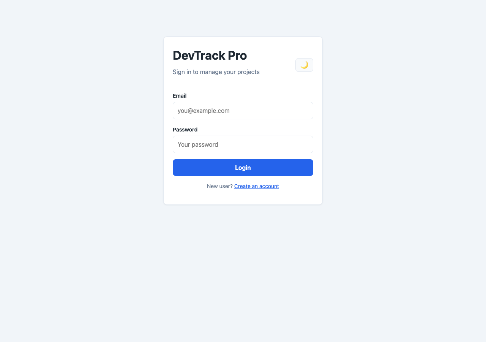
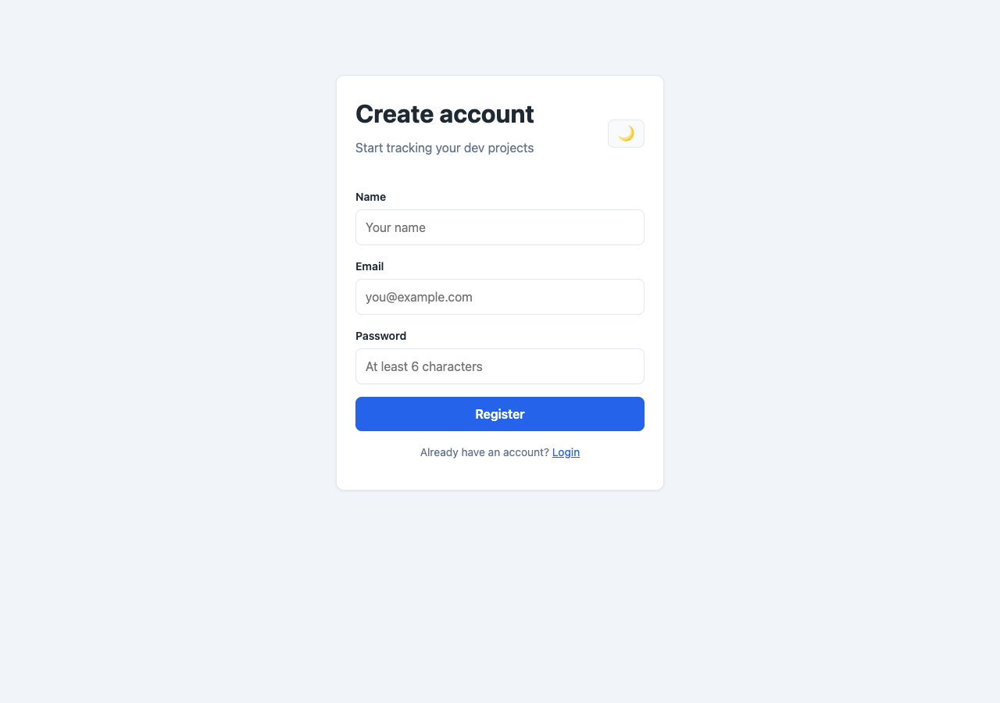
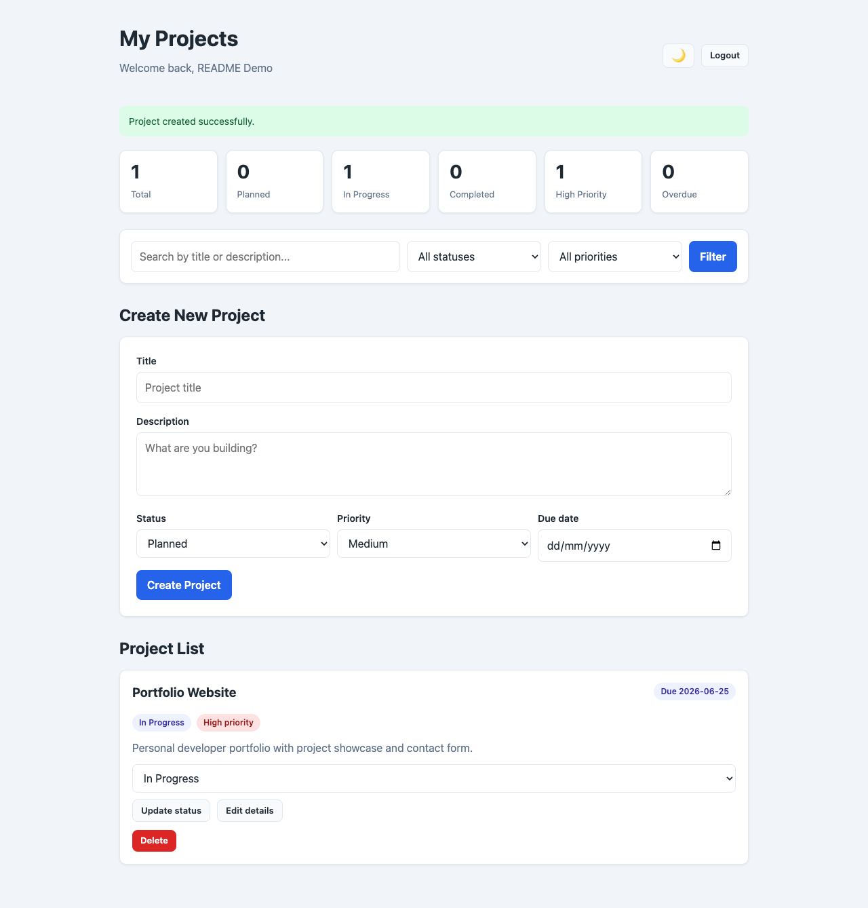
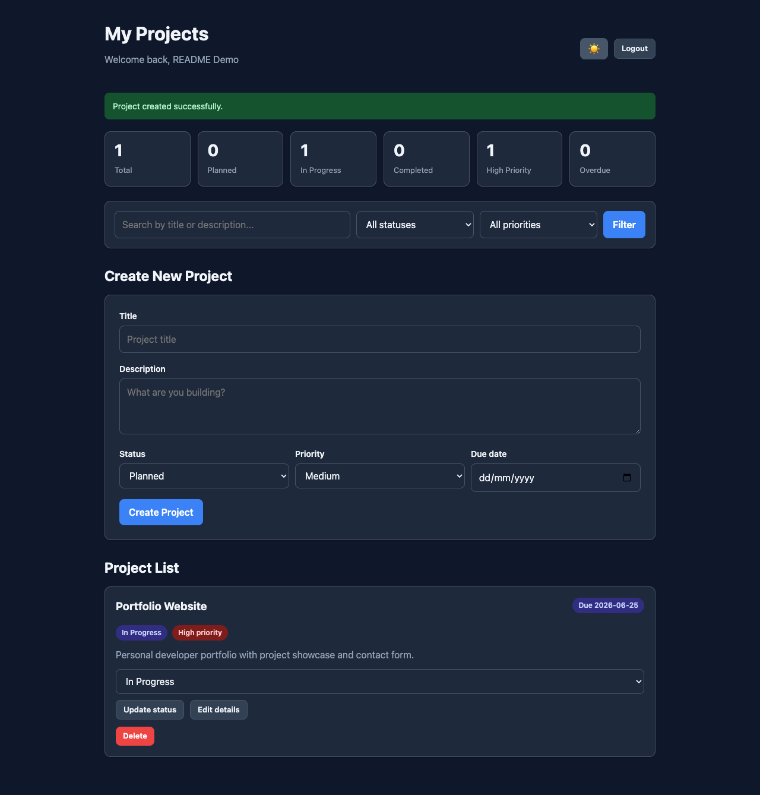

# DevTrack Pro

A simple, focused project tracker for developers who want to keep ideas, deadlines, and progress in one place.

Create projects, track status, set priorities, add due dates, search and filter — all from one clean dashboard.

---

## Live Demo

**Try the app here:** [https://devtrack-pro-1.onrender.com](https://devtrack-pro-1.onrender.com)

| Page | URL |
|------|-----|
| Login | [devtrack-pro-1.onrender.com/login](https://devtrack-pro-1.onrender.com/login) |
| Register | [devtrack-pro-1.onrender.com/register](https://devtrack-pro-1.onrender.com/register) |
| Dashboard | [devtrack-pro-1.onrender.com/dashboard](https://devtrack-pro-1.onrender.com/dashboard) *(login required)* |
| Health check | [devtrack-pro-1.onrender.com/health](https://devtrack-pro-1.onrender.com/health) |

> **Note:** Render free plan par app 15 minute inactive rehne ke baad sleep ho jati hai. Pehli visit par page load hone mein 30–60 seconds lag sakte hain.

---

## Screenshots

### Login Page

Sign in with your email and password. New users can jump to registration from here.



---

### Register Page

Create a new account with name, email, and password (minimum 6 characters).



---

### Dashboard (Light Mode)

Main project hub — stats, search/filter, create projects, and manage existing ones.



**Dashboard features shown:**
- Welcome message with user name
- Stats cards: Total, Planned, In Progress, Completed, High Priority, Overdue
- Search by title or description
- Filter by status and priority
- Create new project form
- Project cards with status badges, due dates, quick status update, edit, and delete

---

### Dashboard (Dark Mode)

Toggle dark mode with the moon/sun button — preference is saved in your browser.



---

## Features

- User registration and login
- Session-based authentication (MongoDB session store)
- Create, edit, and delete projects
- Project status: **Planned**, **In Progress**, **Completed**
- Priority labels: **Low**, **Medium**, **High**
- Optional due dates with **overdue** and **due soon** badges
- Dashboard summary cards including overdue count
- Search projects by title or description
- Filter by status and priority
- Quick status updates from the project list
- Collapsible edit form on each project card
- Dark mode with system preference support
- Flash messages for auth and project actions
- Production-ready Render deployment

---

## Tech Stack

| Layer | Technology |
|-------|------------|
| Runtime | Node.js 20+ |
| Backend | Express.js 5 |
| Database | MongoDB Atlas + Mongoose |
| Views | EJS templates |
| Auth | Express Session + connect-mongo |
| Security | bcrypt password hashing |

---

## Project Structure

```txt
devtrack-pro/
├── Controller/
│   ├── authController.js      # Register, login, logout
│   └── projectController.js   # CRUD, search, filter, stats
├── config/
│   └── db.js                  # MongoDB connection
├── middleware/
│   ├── auth.js                # Route protection
│   └── flash.js               # Success/error messages
├── models/
│   ├── Project.js
│   └── User.js
├── public/
│   ├── css/app.css            # Shared styles + dark theme
│   └── js/theme.js            # Theme toggle
├── routes/
│   ├── authRoutes.js
│   └── projectRoutes.js
├── screenshots/               # App screenshots for docs
├── views/
│   ├── dashboard.ejs
│   ├── login.ejs
│   └── register.ejs
├── app.js                     # Express entry point
├── render.yaml                # Render Blueprint config
├── DEPLOYMENT.md              # Full deploy guide
└── package.json
```

---

## Run Locally

### 1. Install dependencies

```bash
npm install
```

### 2. Create `.env` file

```env
MONGO_URI=your_mongodb_atlas_connection_string
SESSION_SECRET=replace_with_a_long_random_secret
NODE_ENV=development
```

### 3. Start the server

```bash
npm start
```

Open [http://localhost:3000](http://localhost:3000)

### Development (auto-reload)

```bash
npm run dev
```

Requires `nodemon` installed globally or as a dev dependency.

---

## Deploy on Render

This project is already deployed at [https://devtrack-pro-1.onrender.com](https://devtrack-pro-1.onrender.com).

### Quick settings

| Setting | Value |
|---------|--------|
| Build Command | `npm install` |
| Start Command | `npm start` |
| Health Check Path | `/health` |
| Node version | `>=20.19.0` (set in `package.json`) |

### Required environment variables

```env
MONGO_URI=your_mongodb_atlas_connection_string
SESSION_SECRET=use_a_long_random_secret
NODE_ENV=production
```

Do **not** set `PORT` — Render provides it automatically.

### MongoDB Atlas

Before deploying, in MongoDB Atlas:

1. Create a free M0 cluster
2. Create a database user (username + password)
3. **Network Access** → Add IP `0.0.0.0/0` (for demo/student projects)
4. Copy the connection string into `MONGO_URI`

Full step-by-step guide: [DEPLOYMENT.md](DEPLOYMENT.md)

---

## API Routes

| Method | Route | Description |
|--------|-------|-------------|
| GET | `/` | Redirects to login |
| GET | `/login` | Login page |
| POST | `/login` | Authenticate user |
| GET | `/register` | Register page |
| POST | `/register` | Create account |
| GET | `/logout` | End session |
| GET | `/dashboard` | Project dashboard *(auth required)* |
| POST | `/project` | Create project |
| POST | `/project/edit/:id` | Update project |
| POST | `/project/delete/:id` | Delete project |
| POST | `/project/status/:id` | Quick status update |
| GET | `/health` | Health check for Render |

---

## Scripts

```bash
npm start    # Run production server
npm run dev  # Run with nodemon (development)
```

---

## Future Ideas

- Team collaboration
- Project activity timeline
- Kanban board view
- File attachments

---

## Author

Built as a practical full-stack Node.js project.

**Live app:** [https://devtrack-pro-1.onrender.com](https://devtrack-pro-1.onrender.com)
